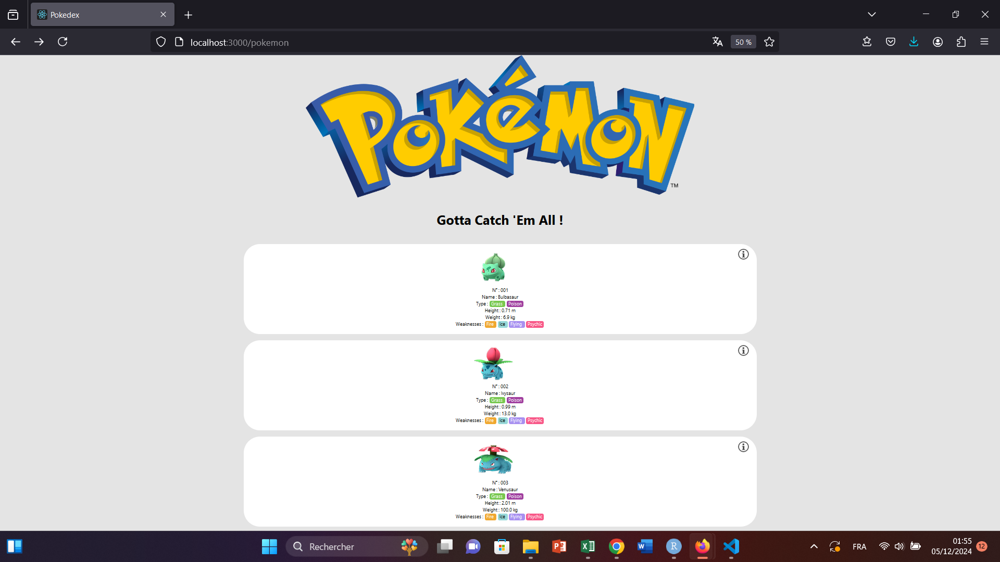

# Pokedex project
It's a project to get familiar with React and NodeJS.  

Clone the repo `git clone https://github.com/CheongLoic/Pokedex.git`

Then go to the Pokedex folder `cd Pokedex`

# Install librairies 
To install node_modules folder if it is not in the project directory : `npm install`

# Run the app
Run at the termirnal `npm start`

Runs the app in the development mode. 
Open [http://localhost:3000](http://localhost:3000) to view it in the browser.

The page will reload if you make edits. 

